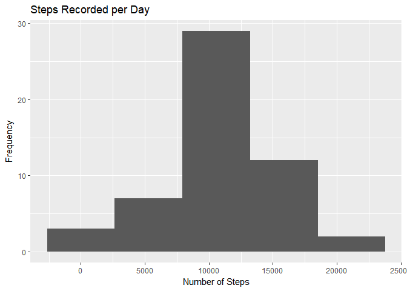

Fitness Monitor Data - Reproducible Research
================
Kevin Cole
August 26, 2018

Reading in the data
-------------------

The following code chunk reads the .CSV file into an object in R. Then, the column "date" is converted from a character string to a date object to simplify our analysis.

``` r
fit_data <- read.csv("activity.csv",  stringsAsFactors = FALSE)
fit_data$date <- as.Date(fit_data$date, "%Y-%m-%d")
```

Aggregate number of steps per day:

``` r
step_totals <- aggregate(steps ~ date, data = fit_data, sum)
```

Plotting Histogram of Steps/Day
-------------------------------

Using ggplot2, a histogram is generated showing how often a certain number of steps was taken per day.

``` r
library(ggplot2)
```

    ## Find out what's changed in ggplot2 at
    ## http://github.com/tidyverse/ggplot2/releases.

    ## 
    ## Attaching package: 'ggplot2'

    ## The following object is masked _by_ '.GlobalEnv':
    ## 
    ##     diamonds

``` r
g <- ggplot(step_totals, aes(steps))
g + geom_histogram(stat = "bin", bins = 5) +
  ggtitle("Steps Recorded per Day") +
  xlab("Number of Steps") +
  ylab("Frequency")
```



Calculating Mean and Median Step Counts
---------------------------------------

The following code will calculate the mean number of steps per day, as well as the median number of steps per day.

``` r
mean_steps <- as.integer(mean(step_totals$steps))
median_steps <- as.integer(median(step_totals$steps))
```

The mean number of steps per day was **10766**. The median number of steps per day was **10765**.

Plotting Average Number of Steps as a Time Series
-------------------------------------------------

The following code calculates the average number of steps per 5-minute interval across all of the days recorded in the data, then plots this average as a time series.

``` r
interval_avg <- aggregate(steps ~ interval, data = fit_data, mean)
g2 <- ggplot(interval_avg, aes(interval, steps))
g2 + geom_line() +
  ggtitle("Average Steps per 5-minute Interval") +
  xlab("5-Minute Interval") +
  ylab("Steps")
```


Calculating the Typically Most Active 5-Minute Interval
-------------------------------------------------------

By finding which 5-minute interval contains on average the highest step count, we can infer during which period of the day the subject is most active.

``` r
max_activity <- interval_avg$interval[which.max(interval_avg$steps)]
```

On average, the highest number of steps was recorded during interval number **835**.

Imputing Missing Values
-----------------------

The following code calculates the number of missing values in the dataset.

``` r
missing_data <- sum(is.na(fit_data))
```

There are 2304 missing observations in the dataset.

In order to fill in this missing data, we can calculate the average number of steps in each 5-minute interval and impute the respective average into each missing observation.

``` r
## Create a new datatable with the original data incl. missing observations
completed_data <- fit_data
## Using a for loop, check each row for NAs in steps column.
for (i in 1:nrow(completed_data)) {
  ## If NA is found, determine which interval index corresponds
  if (is.na(completed_data$steps[i])) {
    index <- which(completed_data$interval[i] == interval_avg$interval)
    ## Assign the computed average for that interval to complete the dataset.
    completed_data$steps[i] <- interval_avg[index,]$steps
  }
}
```

The following code snippet plots a histogram of the total number of steps per day.

``` r
new_dailysteps <- aggregate(steps ~ date, data = completed_data, sum)
g3 <- ggplot(new_dailysteps, aes(steps))
g3 + geom_histogram(stat = "bin", bins = 5) +
  ggtitle("Histogram of Steps Recorded per Day") +
  xlab("Steps per Day") +
  ylab("Frequency")
```


Activty Levels: Weekdays vs. Weekends
-------------------------------------

``` r
library(dplyr, quietly = TRUE)
```

    ## Warning: package 'dplyr' was built under R version 3.3.3

    ## 
    ## Attaching package: 'dplyr'

    ## The following objects are masked from 'package:stats':
    ## 
    ##     filter, lag

    ## The following objects are masked from 'package:base':
    ## 
    ##     intersect, setdiff, setequal, union

``` r
completed_data$day <- weekdays(completed_data$date)
completed_data$daytype <- "weekday"
completed_data$daytype[completed_data$day %in% c("Saturday", "Sunday")] <- "weekend"

daily_avg <- completed_data %>% group_by(daytype, interval) %>% summarize(steps = mean(steps))

g4 <- ggplot(data = daily_avg, aes(interval, steps)) +
             geom_line() +
             xlab("Interval") +
             ylab("Average Number of Steps") +
             ggtitle("Average Steps Recorded, Weekdays vs. Weekends") +
             facet_grid(daytype ~ .)
plot(g4)
```


The plot clearly shows that the subject tends to become active earlier on weekdays than weekends. Additionally, on average there is less activity in the latter intervals during the weekdays in comparison to the weekends.
